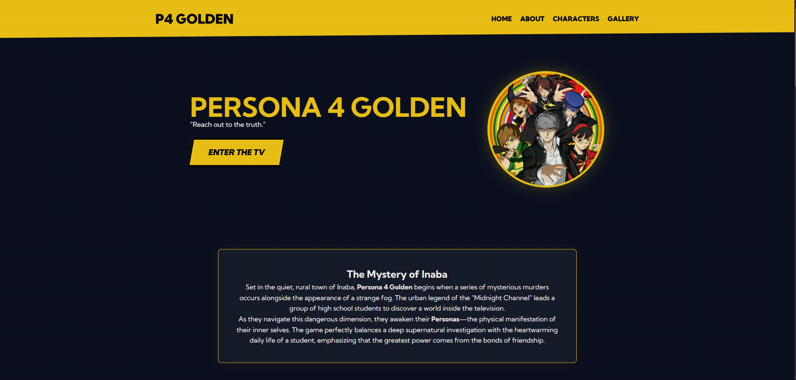

# persona4-landing-page
Landing page inspirada em Persona 4 Golden, desenvolvida com HTML e CSS para praticar layout, identidade visual e estilização temática.
# 📺 Persona 4 Golden - Fan Page

## 📋 Sobre o Projeto
Esta é uma Fan Page interativa inspirada na interface (UI) do jogo **Persona 4 Golden**. O objetivo deste projeto foi explorar técnicas avançadas de CSS, animações de entrada e a criação de uma experiência imersiva para o usuário, simulando a estética "Industrial/Yellow" característica do game.

> **Status do Projeto:** Concluído ✅

---

## 🚀 Tecnologias Utilizadas
*   **HTML5:** Estruturação semântica.
*   **CSS3 Avançado:** Uso de variáveis, Flexbox, Grid e animações `@keyframes`.
*   **Design Responsivo:** Adaptado para diferentes tamanhos de tela.

## ✨ Funcionalidades e Destaques
- **Efeito Visual Imersivo:** Filtros que remetem a telas de TV antigas (CRT).
- **Interatividade:** Cards com efeitos de *hover* dinâmicos e transições suaves.
- **Identidade Visual:** Paleta de cores fiel ao título original da ATLUS.

## 🔗 Link para Acesso
Você pode visualizar o projeto online através do GitHub Pages:
👉 [Visitar Persona 4 Golden Fan Page](https://rodrigopbarros.github.io/Persona-4-Golden/)

---

## 👤 Autor
**Rodrigo P. Barros**
- GitHub: [@RodrigoPBarros](https://github.com/RodrigoPBarros)
- Portfólio: [Meu Portfólio](https://rodrigopbarros.github.io/)
